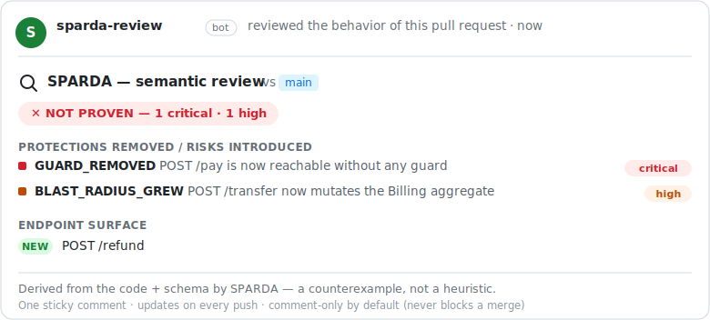

# SPARDA

<div align="center">
  
</div>

<br/>

<div align="center">

## **AI writes. SPARDA proves.**

</div>

AI made writing code free. It made *trusting* code the bottleneck. Your agents open
pull requests faster than any human can truly review them, and the industry's answer
is to have another LLM skim the diff — an opinion grading an opinion.

SPARDA is not an opinion. It's a **behavior compiler**: it compiles your backend
(code + schema) into a deterministic behavior graph, and *proves* things against it —
which guard a PR removed, which invariant a deploy dropped, whether a fix broke
nothing else. Every finding is a **counterexample**, never a vibe. Zero spec to
write, zero config, zero API key, nothing leaves your machine.

One engine, four moves:

| | Command | What it proves |
|---|---|---|
| 🔍 | `sparda review` | the **behavior diff** of a PR — guards dropped, blast radius grown, new endpoints |
| 🛡️ | `sparda apocalypse` | a deploy can't break any declared guard, invariant, transaction or aggregate |
| 🪞 | `sparda mirror` | a live mock **derived from the code** — enforces the real state machine, can never drift |
| ⏪ | `sparda timeless` / `heal` | replay a production bug deterministically; gate the fix with proof, not hope |

And because trust must extend to *runtime*, the same engine turns your app into a
safe set of MCP tools for Claude & friends — writes gated, failures quarantined
(see [Give your AI safe hands](#give-your-ai-safe-hands-the-mcp-layer)).

## Review every PR's *behavior* — one file, zero config

Every code-review tool diffs your **text**. None diff your **behavior**. SPARDA
compiles the PR's base branch and your changes to the behavior graph and comments the
difference — as one sticky comment that updates on every push:

<div align="center">
  
</div>

<br/>

Drop this one file into `.github/workflows/sparda-review.yml` — no key, no account,
no spec to write:

```yaml
name: SPARDA behavior review
on: pull_request
permissions:
  contents: read
  pull-requests: write
jobs:
  review:
    runs-on: ubuntu-latest
    steps:
      - uses: actions/checkout@v4
        with: { fetch-depth: 0 }
      - uses: zyx77550/sparda@main
        with:
          mode: review          # comment-only by default — never blocks a merge
          # fail-on-severity: high   # uncomment to also gate the check
```

Every finding is a **counterexample from the code + schema**, not a pattern-match — so
no false-positive noise to train your team to ignore. Same engine, as a hard CI gate:
`mode: apocalypse` (the default) fails the job on any critical/high and can upload
SARIF to the Security tab.

## Prove the deploy

```bash
npx sparda-mcp apocalypse            # PROVEN, RISKY, or NOT PROVEN — with counterexamples
npx sparda-mcp apocalypse --sarif    # findings land in GitHub's Security tab
```

Five proof obligations discharged over the compiled graph — unguarded mutations,
unvalidated constrained writes, non-atomic aggregate writes, irreversible external
calls, aggregate bypasses — plus a diff against your saved baseline: no entrypoint
silently removed, no guard dropped, no blast radius grown. Exit 1 gates the pipeline.

## A mock that can never lie

```bash
npx sparda-mcp mirror                # the graph IS the server — no framework, no source
```

The mirror serves your compiled behavior over HTTP: guards actually deny (401),
responses come out typed, and the **inferred state machine is enforced** — `POST
/orders` seeds `pending`, paying it moves it to `paid`, paying it *again* is refused
`409`. Hand-written mocks drift; this one is derived from your code + schema, so it's
synchronized by construction. Front-ends develop against backends that aren't
deployed — or written — yet.

## Give your AI safe hands (the MCP layer)

Your AI can write code. It still can't *operate* your app — and giving it raw access
usually means days of glue code and one prayer per `DELETE`. SPARDA deletes that work:

```bash
npx sparda-mcp init   # scan your Express/FastAPI/Next.js app, inject the MCP router — 3 minutes
npx sparda-mcp dev    # connect Claude Desktop / Claude Code. Done.
```

No OpenAPI spec. No account. No API key. No server to host. And the same trust rules
apply at runtime: **writes are disabled by default**, an enabled write needs an
explicit human confirmation (two-phase, single-use token), and every write is followed
by a proof-after-write read-back.

<details>
<summary><b>Quickstart — three steps</b></summary>

1. **Scan + inject** — run once, from your app's directory:
   ```bash
   npx sparda-mcp init
   ```
   SPARDA parses your routes (AST), generates a marked `/mcp` router, injects it into
   your app (with a backup), and writes `sparda.json`. Every step is reversible.

2. **Start your app, then start the bridge:**
   ```bash
   npx sparda-mcp dev
   ```

3. **Connect your client.** `init` prints a ready-to-paste block for
   `claude_desktop_config.json`, pre-filled with your app's name and path:
   ```json
   {
     "mcpServers": {
       "your-app": {
         "command": "npx",
         "args": ["sparda-mcp", "dev"],
         "cwd": "/absolute/path/to/your-app"
       }
     }
   }
   ```
   Claude Code connects to the same bridge. That's it — your running app is now a set
   of MCP tools your AI can call.

</details>

## Try the Standalone Demo

To see SPARDA in action instantly without modifying your codebase:
```bash
npx sparda-mcp demo
```
This runs the entire lifecycle (detect → parse → generate → inject → remove) on a bundled demo app in a temporary folder, illustrating all six guarantees in 10 seconds.

## Black Box Report

SPARDA is designed as a local organism. To see what it remembers and how much compute it has recycled:
```bash
npx sparda-mcp report          # terminal dashboard
npx sparda-mcp report --html   # self-contained offline dashboard at .sparda/report.html
npx sparda-mcp report --json   # raw JSON for integration
```

To undo everything: **`npx sparda-mcp remove`** restores your code byte-for-byte.

## The promise — every word is backed by a test in CI

<div align="center">
  
</div>

<br/>

1. **Proof, not opinion.** Every review/apocalypse finding is a counterexample derived from your code + schema — deterministic, byte-identical run after run, machine after machine.
2. **Three minutes, one command.** AST scan, router generation, reversible injection — no config.
3. **Try it for free, leave for free.** `npx sparda-mcp remove` restores your code **byte-for-byte** (tested on JS, TS, Python, even Windows CRLF files). No trace, no lock-in.
4. **The AI cannot write until you say so.** Every POST/PUT/DELETE is disabled by default; you enable per tool, and your choice survives every re-run.
5. **Nothing leaves your machine.** No telemetry to us, no cloud, local key auth, 4 exact-pinned dependencies.
6. **What it learns is never lost.** Diagnoses, descriptions, settings — versioned with your git, surviving every re-init.

What we *don't* promise: the honest limits in [docs/SECURITY.md](./docs/SECURITY.md).

## How it works

1. **The compiler.** `sparda ubg` (run implicitly by `review`/`apocalypse`/`mirror`) parses your codebase and SQL/Prisma schema (AST — 100% local, zero LLM) into a deterministic behavior graph: entrypoints, guards, effects, state, invariants, state machines. `sparda verify` proves the compiler's own laws (determinism, soundness, round-trip) on your input.
2. **The proofs.** `review` and `apocalypse` discharge proof obligations over that graph; `mirror` executes it; `timeless` records/replays real requests against it.
3. **The MCP layer.** `init` injects a tiny marked router (`/mcp`) into your app — fully reversible with `remove`. Tool calls run **inside your live app process** — warm DB pools, real auth chain, real data. Zero infrastructure: compute from your host process, intelligence from your AI client's own model (MCP sampling), storage from `sparda.json` + git.
4. Suspicious docstrings are sanitized before they ever reach the AI (prompt-injection defense).

## The living organism — what runtime trust looks like

The proof gate covers what AI *writes*. These organs cover what AI *does*, live:

### Write-safety: the AI can't write until you say so
- Writes (POST/PUT/DELETE) ship **disabled**. Enable them per tool in `sparda.json`; your choice survives every re-init.
- An enabled write is **never executed on the first call**. SPARDA returns an `awaiting_confirmation` envelope — a single-use token plus a preview of the action — and commits only after an explicit confirm step.
- When your client supports MCP elicitation, that confirmation prompt appears **in the AI's own UI**.
- **Proof-after-write**: every successful write is followed by a read-back of the same resource, so the AI — and you — see the real effect, not a hopeful guess.

### Your app defends itself — zero LLM on the hot path
- **Quarantine.** A tool that returns 3 consecutive 5xx is quarantined: further calls get a `503` with a reason and a retry delay instead of hammering your broken route. After a cooldown it half-opens for a single probe.
- **Latency & anomaly flags.** The router learns each route's baseline and flags deviations locally, in a few lines of math.
- **Adaptive diagnosis, only on surprise.** A genuinely new failure wakes your AI client's own model to diagnose it once; the diagnosis is cached as an "antibody" in `sparda.json`, so the same failure later costs zero tokens. Cloning your code doesn't clone its immune memory.

### A free intelligence layer, zero API key
On first connection your AI client's own model (via MCP sampling) rewrites raw routes
into business-language tool descriptions and proposes multi-step workflows — cached in
`sparda.json` and exposed as MCP prompts. Nothing to configure, nothing to pay.

### It gets cheaper the more you use it
- **Response recycling.** When a read keeps returning the same answer, SPARDA serves the next identical call straight from memory — without touching your host app. Reads only; writes always hit the host.
- **A recycling gauge.** `GET /mcp/stats` counts how many calls were answered from SPARDA's own knowledge vs. how many paid the host route. It reads 0% on day one and fills with usage — a measure, never a promise.

### Tools nobody wrote — Labs, opt-in, default OFF
Turn it on with `"labs": { "recordSequences": true }` in `sparda.json`. SPARDA then
notices when one tool's output feeds the next tool's input and records the *circuit* —
structure only (tool names, argument names, counts), never your data. A read-only
circuit seen enough times **crystallizes into a composite tool**, announced
mid-session: one call runs the whole chain, auto-feeding each step from the previous
step's real response. Write routes are never absorbed — their per-call confirmation
always stands.

### Living context & telemetry
One call to **`sparda_get_context`** hands the AI the whole living picture: enabled
tools, suggested workflows, runtime telemetry, quarantine state, and immune memory —
so every session resumes where the last one stopped. `GET /mcp/stats` and
`GET /mcp/events` expose the same live picture over HTTP.

## Built for AI clients: the bundled Skill
SPARDA ships with an Agent Skill ([`SKILL.md`](./SKILL.md)) that teaches any compatible
AI client how to drive a SPARDA server to its **full potential** — call
`sparda_get_context` first, exploit response recycling, honor quarantine, prefer
crystallized circuits over re-walking a chain, and follow the two-phase write-confirm
protocol. The live, per-project tool list always comes from `sparda_get_context` at
runtime, so the guidance never goes stale.

## Supported frameworks

- **Next.js App Router (13/14/15)** — file-based injection. Since Next.js uses file-system routing, SPARDA simply creates a catch-all route handler under `app/mcp/[...sparda]/route.js`. **Nothing in your existing codebase's code is touched**; running `remove` simply deletes the generated file.
- **Express 4/5** (JS/TS, ESM/CJS) — AST-based router injection.
- **FastAPI** (Python >= 3.9) — AST-based router injection.
- **Any backend with an OpenAPI spec** — `--openapi api.json` lowers the spec into the same behavior graph, so `review`, `apocalypse`, `mirror` and `openapi` work on Go, Rails, Java, .NET… without a parser.

## Security posture (honest)
- 4 runtime dependencies, exact-pinned.
- Local key on every router call; self-reference loop protection; 30s timeouts; 8 KB output truncation.
- AST-positioned injection with backup and post-injection re-parse; `npx sparda-mcp remove` leaves a clean git diff.
- Persistence is **value-free**: SPARDA records structure (tool names, field names, fingerprints), never your payloads.

Full threat model and known gaps: [docs/SECURITY.md](./docs/SECURITY.md).

## Documentation
- [docs/ARCHITECTURE.md](./docs/ARCHITECTURE.md) — how `init`, the injected router, and the bridge fit together, plus the `sparda.json` schema.
- [docs/SECURITY.md](./docs/SECURITY.md) — threat model, defenses, and honest known gaps.
- [docs/TESTING.md](./docs/TESTING.md) — how the promises above are kept honest in CI.
- [docs/ERRORS.md](./docs/ERRORS.md) — the error knowledge base.

## Beyond the open core
SPARDA is free, including in production (see License). Team-scale capabilities —
fine-grained per-person access policies and a signed, tamper-evident audit log — are
planned for a future paid tier. The open core stands on its own; nothing here is
crippled to upsell you.

## License
[Business Source License 1.1](./LICENSE) — free to use, including in production.
You may not resell SPARDA or offer it as a competing commercial service.
Each version converts to Apache 2.0 four years after its release.

<div align="center">
  
</div>

<br/>

By [Residual Labs](https://residual-labs.fr)
