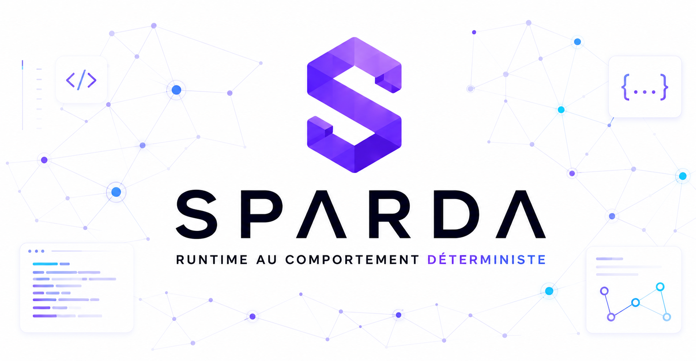
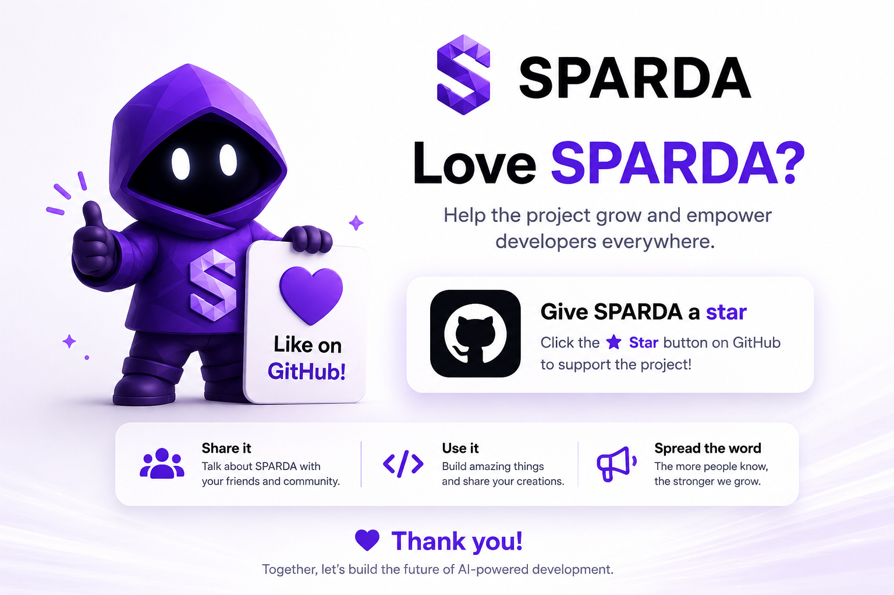

# SPARDA

<div align="center">
  
</div>

<br/>

> 🇫🇷 **Français** : Pour comprendre SPARDA en 10 minutes (douleur, architecture, vision), lisez le document du fondateur : [SPARDA-EXPLIQUE.md](docs/SPARDA-EXPLIQUE.md).

---

**A compiler for backend behavior. The LLVM of web applications.**

For twenty years software communicated through APIs. Then AI agents arrived, and the industry's answer was to expose more endpoints (MCP). But an agent doesn't *understand* an application from a list of disconnected tools — and neither can a linter, a debugger, or a deploy gate reason about a codebase they only read line by line.

SPARDA compiles your backend — routes, database queries, state mutations, permissions, side-effects — into one language-agnostic, mathematical graph: the **Unified Behavior Graph (UBG)**, serialized as `.sparda/ubg.json` under the **SBIR** specification ([SPARDA Behavior IR](docs/SBIR_SPEC_V1.1.md)). Compile once; then every tool is a simple pass over that graph.

> [!IMPORTANT]  
> **The 3700-Route Proof:** In our latest stress-test (v0.26.0), SPARDA successfully compiled and proved **3700+ routes** from elite open-source monsters (Next.js *Dub*, NestJS *Immich*, *MedusaJS*, and GitHub's OpenAPI) in **< 2.2 seconds** per repo, with zero crashes. It natively resolves deep Dependency Injection, external controllers, and Next.js handlers.

**What the graph unlocks — 100% local, deterministic, zero runtime dependencies, zero API key:**

| Command | What it does |
|---|---|
| **`ubg`** | Compile the codebase to its behavior graph (Express · FastAPI · Next.js natively; **any** stack via OpenAPI) |
| **`apocalypse`** | *Prove the deploy* — no guard, invariant, transaction or aggregate boundary can be broken (SARIF + CI gate) |
| **`timeless`** | *Time-travel* — record a production request, replay it byte-identically, export the bug as a test |
| **`heal`** | *Self-heal, proven* — bug → fix → the machine proves the fix is correct and breaks nothing |
| **`mirror`** | *Execute the graph* — serve the compiled behavior over HTTP with no framework and no source |
| **`openapi`** | *Emit the standard* — produce an OpenAPI 3.1 spec from the graph |
| **`verify`** | *Prove the compiler's own laws* (determinism, soundness, round-trip) on your app |
| **`init` / `dev`** | Expose the graph to AI clients as a live MCP server (+ Twin, Immune, Evolution runtime layer) |

```bash
npx sparda-mcp ubg          # compile your backend → .sparda/ubg.json
npx sparda-mcp apocalypse   # prove the current tree is safe to deploy
```

No cloud account. No server to host. Exposing raw APIs to AI is the old way — SPARDA compiles the whole system's behavior, then proves, replays, heals, and serves it.

**Nomenclature:** **SBIR** is the specification (the format, like "JSON"); **UBG** is the compiled graph itself (the artifact, `ubg.json`). The MCP server is one *output* of the graph, not the product.

## Quickstart

1. **Scan + inject** — run once, from your app's directory:
   ```bash
   npx sparda-mcp init
   ```
   SPARDA parses your routes (AST), generates a marked `/mcp` router, injects it into
   your app (with a backup), and writes `sparda.json`. Every step is reversible.

2. **Start your app, then start the bridge:**
   ```bash
   npx sparda-mcp dev
   ```

3. **Connect your client.** `init` prints a ready-to-paste block for
   `claude_desktop_config.json`, pre-filled with your app's name and path:
   ```json
   {
     "mcpServers": {
       "your-app": {
         "command": "npx",
         "args": ["sparda-mcp", "dev"],
         "cwd": "/absolute/path/to/your-app"
       }
     }
   }
   ```
   Claude Code connects to the same bridge. That's it — your running app is now a set
   of MCP tools your AI can call.

## Try the Standalone Demo

To see SPARDA in action instantly without modifying your codebase:
```bash
npx sparda-mcp demo
```
This runs the entire MCP lifecycle (detect → parse → generate → inject → remove) on a bundled demo app in a temporary folder, in about 10 seconds. For the compiler itself, run `npx sparda-mcp ubg` then `apocalypse` on any Express/FastAPI app.

## Black Box Report

SPARDA is designed as a local organism. To see what it remembers and how much compute it has recycled:
```bash
npx sparda-mcp report
```
This prints a terminal dashboard aggregating your exposed tools, write opt-ins, proof journal decisions, and crystallized composite tools.

To write a self-contained, offline HTML dashboard at `.sparda/report.html`, append the `--html` flag:
```bash
npx sparda-mcp report --html
```

To output raw JSON for integration:
```bash
npx sparda-mcp report --json
```

## Deployment Proof: Apocalypse

SPARDA's Behavior Graph is a formal model of your system. Instead of waiting for runtime failures or relying on static analysis vibes, you can statically prove the safety of your backend before any deployment:
```bash
npx sparda-mcp apocalypse
```
This command reads the compiled `.sparda/ubg.json` (with zero source code parsing at runtime) and discharges five static correctness obligations:
* **Unguarded Mutation (Critical)**: Flags any mutation path that does not cross a security `guard`.
* **Non-Atomic Aggregate Write (High)**: Flags when an API writes to multiple tables of the same Consistency Domain (Aggregate) outside a single transaction scope.
* **Unvalidated Constrained Write (Medium)**: Flags writes into columns with declared invariants (CHECK, NOT NULL, UNIQUE — parsed from your `.sql` DDL **or `schema.prisma`**, Prisma enums included) without prior validation (Zod/Pydantic).
* **Irreversible Observable Effect (High)**: Flags out-of-process actions (like Stripe charges) that happen alongside state writes without a structural compensation path (like a catch-refund).
* **Aggregate Member Bypass (Info)**: Flags mutating a member table directly without routing through the aggregate root.

To save your current graph as a safe baseline:
```bash
npx sparda-mcp apocalypse --save-baseline
```
Subsequent runs will diff the candidate graph against this baseline to detect regression vectors:
* Deletion of any security `guard` (Critical).
* Deletion of a database SQL invariant (High).
* API blast radius expansion (Medium).

If any Critical or High finding is found, `apocalypse` exits with a non-zero code to block your CI pipeline.

**One step in your workflow — findings land in the GitHub Security tab (SARIF):**
```yaml
- uses: zyx77550/sparda@main
  with:
    sarif: 'true'
```

## Time Travel: Timeless

Every production request is deterministic between its effects — the compiler knows exactly where the nondeterminism lives (db, http, clock, random, uuid: the effect nodes of the graph). Timeless records only those points (a few KB per request) and replays the request **byte-identically** against your current code, with the database, webhooks and clock virtualized from the recording:

```bash
npx sparda-mcp timeless                # list recorded flights
npx sparda-mcp timeless replay <id>    # re-fly it — byte-identical or loud divergence
npx sparda-mcp timeless export <id>    # the production bug is now a vitest test
```

Recording is two lines in your app (ESM), with deterministic sampling and GDPR redaction built in:
```js
import { getFlightBox } from 'sparda-mcp/src/flight/box.js';
const box = getFlightBox(); box.arm();
app.use(box.middleware({ sample: 100 }));   // 1 request in 100; passwords/tokens redacted by default
const db = box.wrapClient(pgPool);           // your query client, tapped
```

The closed loop nobody else has: **production bug → recorded flight → failing test → AI writes the fix → `apocalypse` proves the fix breaks no guard, invariant or transaction → deploy.** Replay is per-request (concurrent-race capture is out of scope for v1 — stated, not hidden).

## Self-Healing, Proven: `sparda heal`

The loop above, as **one gesture** — and the machine judges the fix, whoever wrote it:

```bash
npx sparda-mcp heal <flightId>                       # diagnose + write the fix brief
# ...apply the fix (a human, or --agent "your-ai-cli")...
npx sparda-mcp heal <flightId> --check --expect '{"status":404}'
```

The brief is built from the graph itself — it hands the fixer the handler's `file:line`, the capabilities the fix must not grow, and the guards it must not remove. Then the **gate** — the actual product — proves the fix on three axes at once:

1. **Behavior** — lenient replay of the recorded flight (same deterministic inputs) now produces the *expected* response, not the recorded bug. The fix may reformulate a query (the tap is relabeled, allowed); it may **not** change the effect order or kinds.
2. **Compiler laws** — `verify` still passes: the graph is still sound and deterministic.
3. **No regression** — `apocalypse` diff against the frozen pre-fix graph: zero new critical/high findings, no guard removed, no blast radius grown.

```
✓ HEALED & PROVEN — same recorded inputs, correct output, zero law broken, zero protection lost. Ship it.
```

The gate is honest in both directions: an unfixed bug, or a "fix" that silently drops a guard, keeps it **closed** (exit 1). This is the difference between an AI that writes plausible code and a system that *proves* the code is correct — the trust layer the agent era is missing.

## Any Backend On Earth: OpenAPI Lowering

SPARDA parses Express, FastAPI and Next.js natively — and **every other stack through the format the industry already agreed on**. Go, Java, Rails, Laravel, .NET: if it has an OpenAPI spec, it compiles.

```bash
npx sparda-mcp ubg --openapi openapi.json
```

Security schemes become gating `guard` nodes, response schemas become typed returns, declared request bodies count as validated input. Pair the spec with your `.sql` or `schema.prisma` files and the full state layer — invariants, aggregates, state machines — fills in from declared truth. (JSON specs in v1; we refuse to half-parse YAML with zero dependencies.)

## The Mirror VM: delete the framework, the app still answers

The graph is not a diagram — it executes:

```bash
npx sparda-mcp mirror
```

```
MIRROR — the graph is serving. 3 entrypoint(s) on http://127.0.0.1:4477
  GET    /orders/{orderId}  → {amount, id, status}
  POST   /orders  🔒 bearerAuth  → {amount, id, status}
```

No Express. No FastAPI. No source code — just `ubg.json` answering HTTP: guards actually deny (401), responses render the compiled return schemas, unknown paths 404 with the full route table. Front-end teams develop against backends that aren't deployed yet — or aren't written yet (point `mirror` at an OpenAPI spec). Every response carries `x-sparda-mirror: true`; the mirror serves declared behavior, it never invents business values.

To undo everything: **`npx sparda-mcp remove`** restores your code byte-for-byte.

## The promise — every word is backed by a test in CI

<div align="center">
  
</div>

<br/>

1. **Three minutes, one command.** AST scan, router generation, reversible injection — no config.
2. **Try it for free, leave for free.** `npx sparda-mcp remove` restores your code **byte-for-byte** (tested on JS, TS, Python, even Windows CRLF files). No trace, no lock-in.
3. **The AI cannot write until you say so.** Every POST/PUT/DELETE is disabled by default; you enable per tool, and your choice survives every re-run.
4. **Your app defends itself.** A route failing 3 times in a row is quarantined — the AI can't hammer your broken production. Latency anomalies are flagged. Zero LLM needed.
5. **Nothing leaves your machine.** No telemetry to us, no cloud, local key auth, 4 exact-pinned dependencies.
6. **What it learns is never lost.** Diagnoses, descriptions, settings — versioned with your git, surviving every re-init.

What we *don't* promise: the honest limits in [docs/SECURITY.md](./docs/SECURITY.md).

## How it works

1. `npx sparda-mcp init` parses your codebase (AST), extracts every route, and injects a tiny marked router (`/mcp`) into your app — fully reversible with `npx sparda-mcp remove`.
2. Tool calls run **inside your live app process** — warm DB pools, real auth chain, real data. SPARDA adds no infrastructure: compute comes from your host process, intelligence from your AI client's own model (MCP sampling), storage from `sparda.json` + git.
3. Write tools (POST/PUT/DELETE) are **disabled by default**. You opt in per tool in `sparda.json` — your choices survive re-runs.
4. Suspicious docstrings are sanitized before they ever reach the AI (prompt-injection defense).
5. `npx sparda-mcp doctor --app` audits your codebase for drift: it detects stale tools (IA seeing ghosts), unsynced routes, schema drift via fingerprints, and zombie configurations. High severity issues trigger a non-zero exit code for your CI pipeline.
6. `npx sparda-mcp seed export/import` lets you package and share your app's "genome" (semantic memory, workflows, antibodies) securely, transferring immune memory between environments or across similar stacks with zero data leak.
7. `npx sparda-mcp twin` starts a safe, simulated mock server of your backend on the original port. It serves GET calls from learned exemplars (observed response shapes & mock data) and returns simulated 202 writes without ever touching your real database or production APIs. Learn exemplars by running `npx sparda-mcp twin --learn`.
8. `npx sparda-mcp grammar` maps the graph of valid sequences of tool calls (observed circuits and candidate hypotheses) to prevent LLM hallucination of routes.
9. `npx sparda-mcp evolve` mutates candidate chains and tests them against the twin in-memory, promoting successful chains to evolved workflow suggestions.

## What SPARDA gives your AI

### Operate, not just read
Every route becomes a tool that runs against your live process — real auth, real data,
warm connections. One call to **`sparda_get_context`** hands the AI the whole living
picture: enabled tools, suggested workflows, runtime telemetry, quarantine state, and
immune memory — so every session resumes where the last one stopped.

### Write-safety: the AI can't write until you say so
- Writes (POST/PUT/DELETE) ship **disabled**. Enable them per tool in `sparda.json`; your choice survives every re-init.
- An enabled write is **never executed on the first call**. SPARDA returns an `awaiting_confirmation` envelope — a single-use token plus a preview of the action — and commits only after an explicit confirm step.
- When your client supports MCP elicitation, that confirmation prompt appears **in the AI's own UI**.
- **Proof-after-write**: every successful write is followed by a read-back of the same resource, so the AI — and you — see the real effect, not a hopeful guess.

### Your app defends itself — zero LLM on the hot path
- **Quarantine.** A tool that returns 3 consecutive 5xx is quarantined: further calls get a `503` with a reason and a retry delay instead of hammering your broken route. After a cooldown it half-opens for a single probe.
- **Latency & anomaly flags.** The router learns each route's baseline and flags deviations locally, in a few lines of math.
- **Adaptive diagnosis, only on surprise.** A genuinely new failure wakes your AI client's own model to diagnose it once; the diagnosis is cached as an "antibody" in `sparda.json`, so the same failure later costs zero tokens. Cloning your code doesn't clone its immune memory.

### A free intelligence layer, zero API key
On first connection your AI client's own model (via MCP sampling) rewrites raw routes
into business-language tool descriptions and proposes multi-step workflows — cached in
`sparda.json` and exposed as MCP prompts. Nothing to configure, nothing to pay.

### It gets cheaper the more you use it
- **Response recycling.** When a read keeps returning the same answer, SPARDA serves the next identical call straight from memory — without touching your host app. Reads only; writes always hit the host.
- **A recycling gauge.** `GET /mcp/stats` counts how many calls were answered from SPARDA's own knowledge vs. how many paid the host route. It reads 0% on day one and fills with usage — a measure, never a promise.

### Tools nobody wrote — Labs, opt-in, default OFF
Turn it on with `"labs": { "recordSequences": true }` in `sparda.json`. SPARDA then
notices when one tool's output feeds the next tool's input and records the *circuit* —
structure only (tool names, argument names, counts), never your data. A read-only
circuit seen enough times **crystallizes into a composite tool**, announced
mid-session: one call runs the whole chain, auto-feeding each step from the previous
step's real response. Write routes are never absorbed — their per-call confirmation
always stands.

### Living context & telemetry
`GET /mcp/stats` (per-tool calls/errors, tool "purity", quarantine state) and
`GET /mcp/events` (errors, latency anomalies, cached diagnoses) expose exactly what
your app is doing — surfaced to the AI as live notifications.

## Built for AI clients: the bundled Skill
SPARDA ships with an Agent Skill ([`SKILL.md`](./SKILL.md)) that teaches any compatible
AI client how to drive a SPARDA server to its **full potential** — call
`sparda_get_context` first, exploit response recycling, honor quarantine, prefer
crystallized circuits over re-walking a chain, and follow the two-phase write-confirm
protocol. The live, per-project tool list always comes from `sparda_get_context` at
runtime, so the guidance never goes stale.

## Supported frameworks

- **Next.js App Router (13/14/15)** — file-based injection. SPARDA creates a catch-all route handler. It natively resolves wrapped handlers (`export const POST = withAuth(h)`) and deep effect chains.
- **NestJS** — AST-based router injection. Deeply resolves Multi-hop Dependency Injection (Controller → Service → Repository), inherited DI, and `baseUrl`/`paths` imports. Supports Prisma, TypeORM, and Kysely.
- **Express 4/5** (JS/TS, ESM/CJS) — AST-based router injection. Deeply resolves external controllers, Mongoose schemas, and barrel re-exports. Uses dynamic tree-scanning to find non-standard entry points (`bootstrap.ts`, etc).
- **MedusaJS** — Native AST ingestion of complex e-commerce routing.
- **Any Backend On Earth (Go, Java, Rails, Laravel)** — Compiles flawlessly from OpenAPI 3.x specs.
- **FastAPI** (Python >= 3.9) — AST-based router injection.

## Security posture (honest)
- 4 runtime dependencies, exact-pinned.
- **Dynamic Local Key Resolution.** The generated router contains no baked secrets. It resolves authorization keys at runtime from the `SPARDA_LOCAL_KEY` environment variable or the local gitignored `.sparda/key` file, and fails closed (503) when neither is found. For custom production or staging setups, you can override this behavior by exposing `SPARDA_LOCAL_KEY` in your environment.
- Local key on every router call; self-reference loop protection; 30s timeouts; 8 KB output truncation.
- AST-positioned injection with backup and post-injection re-parse; `npx sparda-mcp remove` leaves a clean git diff.
- Persistence is **value-free**: SPARDA records structure (tool names, field names, fingerprints), never your payloads.

Full threat model and known gaps: [docs/SECURITY.md](./docs/SECURITY.md).

## Documentation
- [docs/ARCHITECTURE.md](./docs/ARCHITECTURE.md) — how `init`, the injected router, and the bridge fit together, plus the `sparda.json` schema.
- [docs/SECURITY.md](./docs/SECURITY.md) — threat model, defenses, and honest known gaps.
- [docs/TESTING.md](./docs/TESTING.md) — how the promises above are kept honest in CI.
- [docs/ERRORS.md](./docs/ERRORS.md) — the error knowledge base.

## Beyond the open core
SPARDA is free, including in production (see License). Team-scale capabilities —
fine-grained per-person access policies and a signed, tamper-evident audit log — are
planned for a future paid tier. The open core stands on its own; nothing here is
crippled to upsell you.

## License
[Business Source License 1.1](./LICENSE) — free to use, including in production.
You may not resell SPARDA or offer it as a competing commercial service.
Each version converts to Apache 2.0 four years after its release.

<div align="center">
  
</div>

<br/>

## Residual Labs

**We don't pitch. We prove.** · *On ne vend pas de rêve. On prouve.*

SPARDA is the first instrument from [**Residual Labs**](https://residual-labs.fr) — a
deep-tech engineering lab building **proof-grade tools for problems that can't afford to
be wrong**. Deterministic, offline, honest about their own blind spots. SPARDA is where
we started, not where we stop.

*Un laboratoire d'ingénierie deep-tech : des outils de niveau preuve pour les problèmes
qui n'ont pas droit à l'erreur.*

**A hard problem in systems, verification, or AI-written software?**
→ [residual-labs.fr](https://residual-labs.fr) · or open an issue on this repo.
